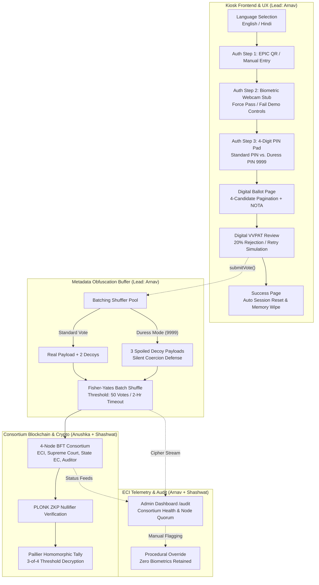

# TrustBallot — Networked Cryptographically-Secure Kiosk Voting System

[](https://react.dev/)
[](https://www.typescriptlang.org/)
[](https://vitejs.dev/)
[](https://tailwindcss.com/)
[](#-prd-compliance-matrix-arnavs-scope)

> **Repository**: [https://github.com/ArnavSemwal/TrustBallot](https://github.com/ArnavSemwal/TrustBallot)  
> **Academic / Prototype Cycle**: 3-Month Delivery MVP  
> **Target Problem**: Enabling secure remote voting for India's ~300M domestic migrant voters.

---

## 📌 Executive Summary & Problem Statement

India has an estimated **300 million internal migrant citizens** who are routinely disenfranchised during general and state elections due to the prohibitive cost, transit time, and logistical burden of returning to their home constituencies. The Election Commission of India's (ECI) 2022 Remote Voting Machine (RVM) prototype was non-networked, physically isolated, and failed to adequately resolve remote double-voting, coercion resilience, or verifiable tallying.

**TrustBallot** solves this by introducing a networked, cryptographically-verifiable kiosk voting system built on:
1. **Zero-Knowledge Proofs (ZKP)** for identity and eligibility verification without disclosing voter identity.
2. **Threshold Paillier Homomorphic Encryption (HE)** for encrypted on-chain tallying ($t = 3\text{-of-}4$ consortium threshold).
3. **A 4-Node BFT Consortium Blockchain** (ECI Primary, Supreme Court, State EC, Independent Auditor) preventing single-point failure or partisan tampering.
4. **A Coercion-Resistant Physical Kiosk & Middleware Layer** featuring Duress PIN protection, metadata obfuscation shuffling, and touch-optimized symbol navigation.

---

## 🏗 System Architecture & End-to-End Flow



---

## 👨‍💻 Engineering Ownership & Deliverables: Arnav

Per the **PRD v1.2** specification, all Kiosk User Experience, Voter Authentication UI, Coercion Resistance (Duress PIN), Metadata Obfuscation Middleware, and the ECI Telemetry Dashboard are owned and implemented by **Arnav (Frontend/UX & Middleware Lead)**.

### 1. 🪪 Kiosk Authentication & Biometrics (`src/pages/AuthPage.tsx`)
- **Step 1 — EPIC/QR Scan & Keypad**: Touch-friendly virtual numeric keypad for manual EPIC entry alongside QR scanner laser sweep animation.
- **Step 2 — Biometric Face-Match Stub**: 
  - Integrated `react-webcam` with continuous laser-sweep alignment grid.
  - **PRD v1.2 P0 Compliance**: Replaced automatic timeout with **explicit Demo Controls** ("Demo: Force Pass" / "Demo: Force Fail").
  - Integrated failure handling overlay allowing demonstrators to showcase biometric rejection and retry workflows.
- **Step 3 — Secure Voting PIN Entry**: 4-digit PIN pad that seamlessly authenticates the voter and arms duress protection before loading the ballot.

### 2. 🛡 Coercion Protection: Duress PIN Engine (`src/context/KioskContext.tsx` & `AuthPage.tsx`)
- **Threat Model Addressed (PRD §8.9)**: Protects vulnerable migrant workers coerced by bad actors outside or near the polling kiosk.
- **Trigger**: Entering the pre-configured emergency code **`9999`** triggers `duressMode: true` silently in memory.
- **Silent Spoofing Execution**: 
  - The voter experiences the exact same UI, ballot confirmation, and success feedback.
  - In `KioskContext.tsx`, `submitVote()` intercepts the real vote payload, drops the voter's actual candidate selection, and dispatches a **silent spoiled decoy payload** into the metadata pool.
  - Prevents the coercer from verifying compliance while rendering the coerced vote null and void on-chain.
- **Helper Guidance**: Includes subtle localized helper text ("Demo Tip: Enter 9999 to trigger Duress PIN silent spoof").

### 3. 🗳 Digital Ballot & Touch Pagination (`src/pages/BallotPage.tsx`)
- **Optimized for Low-Literacy Migrants**: Large, high-contrast party symbols, color-coded borders, and localized party and candidate names.
- **Strict Single-Viewport Zero-Scroll Constraints**: Physical kiosks cannot rely on vertical native scrolling without breaking touch ergonomy. Implemented clean **4-candidates-per-page touch slicing** with touch-friendly Previous/Next buttons.
- **Deterministic NOTA Placement**: Ensured None of the Above (NOTA) is strictly preserved on the final page as mandated by ECI electoral protocol.

### 4. 🔄 Voter-Facing Error & Retry State (`src/pages/ReviewPage.tsx`)
- **Smart Contract Rejection Simulation**: Built-in 20% simulated network rejection / nullifier collision (`NULLIFIER_COLLISION`) on vote submission.
- **Recovery Modal**: Voter is presented with a non-technical, accessible error dialog allowing instantaneous cryptographic re-submission without losing ballot context or resetting session data.

### 5. 🌐 Global Bilingual Localization Engine (`src/context/KioskContext.tsx`)
- Instantaneous switching between **English** and **Hindi**.
- Deep localization across:
  - Header step indicators and timer notifications.
  - Candidate names and party manifestos (`name: { en: "...", hi: "..." }`).
  - Digital VVPAT slip details and audit disclaimers.
  - Demo toggles, failure modals, and timeout warning banners.

### 6. 🔀 Stateful Metadata Obfuscation Middleware (`src/context/KioskContext.tsx`)
- **Metadata Leakage Prevention (PRD v1.2 P1)**: To prevent timing analysis attacks linking network packets to physical voters at a kiosk, `submitVote` routes votes through a batch buffer:
  - Generates 1 real payload + 2 synthetic decoy payloads per submission.
  - **Batch Capacity**: Holds up to **50–100 votes** (configured to 50 threshold).
  - **Timeout Flush**: Flushes every **2 hours** (`7,200,000 ms`).
  - **Fisher-Yates Shuffle**: Completely randomizes transaction order prior to consortium dispatch.

### 7. ⏱ Kiosk Session Security & Inactivity Protection (`src/App.tsx`, `KioskContext.tsx`)
- **Zero-Trust Physical Security**: Enforces a strict 60-second session inactivity timer.
- **Event-Capturing Reset**: Attached window listeners in the **capturing phase** (`{ capture: true }`) so nested buttons with `e.stopPropagation()` cannot bypass inactivity tracking.
- **Emergency Wipe**: If the timer reaches 0, all biometric data, EPIC tokens, and pending ballots in memory are purged, returning the kiosk to `/`.
- **Warning Toast**: Floating non-intrusive alert mounts when $\le 15\text{s}$ remain.

### 8. 📊 Admin & Auditor Telemetry Control Room (`src/pages/AdminDashboard.tsx`)
- **Route**: `/audit` (completely exempt from kiosk session timeouts).
- **Aesthetic**: Hyper-minimalist, high-density **Vercel/Linear-inspired dark monochrome** interface (`#000000` true dark, `#111111` cards, `#ededed` text).
- **Live BFT Node Consortium**: Real-time health status of 4 distributed consortium nodes (ECI Primary, Supreme Court, State EC Node, Independent Auditor) verifying 3-of-4 quorum.
- **Encrypted Ciphertext Stream**: Fixed-height auto-scrolling terminal (`h-[28rem]`) displaying live encrypted transaction hashes and cryptographic seal confirmations.
- **Procedural Override Section**: Allows presiding officers to flag suspicious transactions/sessions for independent judicial review while guaranteeing the **Strict Constraint**: *No biometric or plain-text voting data is ever retained*.

---

## 📋 PRD Compliance Matrix (Arnav's Scope)

| Feature | Priority | PRD v1.2 Requirement | Implementation Status | Location |
| :--- | :---: | :--- | :---: | :--- |
| **EPIC QR Scan + Camera UI** | **P0** | QR scanning simulation + camera feed | ✅ Complete | `src/pages/AuthPage.tsx` |
| **Face-Match Pass/Fail Toggle** | **P0** | Biometric webcam stub with demo pass/fail controls | ✅ Complete | `src/pages/AuthPage.tsx` |
| **Kiosk UI & Touch Pagination** | **P1** | Regional languages $\times 2$ (EN/HI), symbols, 15-30+ candidate pagination | ✅ Complete | `src/pages/BallotPage.tsx` |
| **Duress PIN Flow** | **P1** | Coercion-resistant decoy submission via emergency PIN (9999) | ✅ Complete | `src/pages/AuthPage.tsx`<br/>`src/context/KioskContext.tsx` |
| **Contract Rejection / Retry** | **P1** | Voter-facing error dialog on nullifier collision / rejection | ✅ Complete | `src/pages/ReviewPage.tsx` |
| **Metadata Obfuscation** | **P1** | Batched shuffle (50-100 votes, 2-hr timeout flush) | ✅ Complete | `src/context/KioskContext.tsx` |
| **Admin / Audit Dashboard** | **P2** | ECI backend control room, node health, ciphertext log | ✅ Complete | `src/pages/AdminDashboard.tsx` |
| **Disputed Vote Flagging UI** | **P2** | Procedural override dispute form (no biometrics stored) | ✅ Complete | `src/pages/AdminDashboard.tsx` |

---

## 📁 Repository Structure

```tree
TrustBallot/
├── README.md                      # Primary System Documentation & Handoff Reference
└── master-kiosk/                  # Unified Master Kiosk Application
    ├── package.json               # Dependencies & Build Scripts (React 19, Vite, Tailwind v4)
    ├── vite.config.ts             # Vite Configuration
    ├── index.html                 # App Mount Point
    └── src/
        ├── App.tsx                # Client Routing & Global Inactivity Warning
        ├── main.tsx               # Root Mount & BrowserRouter Initialization
        ├── index.css              # Custom Dark Scrollbars & Tailwind v4 Design Tokens
        ├── context/
            └── KioskContext.tsx   # Global State: Localization, Timer, Duress Mode, Batch Buffer
        ├── pages/
            ├── LanguagePage.tsx   # Welcome Screen & Language Selector (English / Hindi)
            ├── AuthPage.tsx       # EPIC Entry, Face-Match Stub (Demo Controls), Duress PIN
            ├── BallotPage.tsx     # Candidate Grid with Touch Pagination & NOTA
            ├── ReviewPage.tsx     # Digital VVPAT Review & Rejection / Retry Modal
            ├── SuccessPage.tsx    # Cryptographic Seal Confirmation & Auto-Reset
            └── AdminDashboard.tsx # High-Density Linear-Style Auditor & Telemetry Room
        └── imports/               # Assets & Party Emblems
```

---

## 🚀 Setup & Local Execution Guide

### Prerequisites
- **Node.js**: v18.0.0 or higher
- **npm** or **pnpm** installed
- Web browser with webcam access (for Face-Match biometric simulation)

### Installation
```bash
# 1. Clone the repository
git clone https://github.com/ArnavSemwal/TrustBallot.git
cd TrustBallot/master-kiosk

# 2. Install dependencies
npm install
```

### Running Development Server
```bash
npm run dev
```
The application will launch at:
- **Kiosk Voter Interface**: `http://localhost:5173/` (or designated port, e.g., `http://localhost:8443/`)
- **ECI Admin / Audit Console**: `http://localhost:5173/audit`

### Building for Production
```bash
npm run build
```
Build output will be generated cleanly in `master-kiosk/dist/` without TypeScript or bundle errors.

---

## 🧪 Quick Test & Demonstration Scripts

1. **Standard Voting Flow**:
   - Navigate to `/`. Choose **English** or **Hindi**.
   - Enter any 10-digit EPIC number (e.g., `1234567890`) $\rightarrow$ Click **Verify & Proceed**.
   - On the webcam screen, click **Demo: Force Pass**.
   - Enter standard PIN `1234` $\rightarrow$ Click **Confirm Identity**.
   - Browse candidate pages using the pagination buttons $\rightarrow$ Select a candidate $\rightarrow$ Click **Vote**.
   - Review your Digital VVPAT $\rightarrow$ Click **Confirm & Cast Vote**.
   - Observe immediate cryptographic seal confirmation on `SuccessPage`.

2. **Duress Mode Coercion Defense**:
   - Go through Auth Step 1 and 2.
   - On Step 3 (PIN Pad), enter the emergency duress code: **`9999`**.
   - Proceed through ballot selection and submission as normal.
   - Open browser developer tools / console: observe that the voter's actual choice was discarded and replaced with **3 silent decoy payloads** into the batch pool.

3. **Biometric Failure Flow**:
   - On the webcam screen, click **Demo: Force Fail**.
   - Observe the camera border turning red with an error modal and **Try Again** button.

4. **Telemetry & Audit Room**:
   - Navigate to `/audit`.
   - Review BFT Node consensus indicators (ECI, Supreme Court, State EC, Auditor).
   - Inspect the real-time ciphertext terminal with auto-scrolling transaction hashes.
   - Test procedural dispute flagging by submitting a mock session token.

---

## 🔄 Checkpoint & Session Handoff Reference

> **For Collaborators & AI Assistants (Anushka, Shashwat, or Next Engineering Sessions)**:
- **Current State**: All frontend components, kiosk UX screens, coercion mitigation mechanisms, and middleware simulation assigned to **Arnav** are **100% complete, verified, and compiling cleanly**.
- **Integration Touchpoints**:
  - **Crypto Layer (Anushka)**: Real ZKP generation and Paillier homomorphic tallying will replace the mock payloads in `src/context/KioskContext.tsx` (`submitVote`).
  - **Backend & Networking (Shashwat)**: The websocket stream mock in `src/pages/AdminDashboard.tsx` (`wss://kiosk-mesh.local/stream`) and the batch flush dispatch in `KioskContext.tsx` (`flushPool()`) are ready to be plugged into the real BFT node networking API.
- **Zero Scroll Mandate**: Maintain the `h-screen overflow-hidden` wrapper on all voter-facing pages (`/auth`, `/ballot`, `/review`, `/success`) to ensure physical kiosk screen immutability. Only `/audit` supports natural vertical scrolling.
