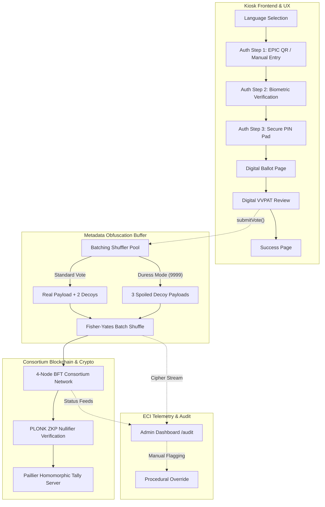

# TrustBallot — Networked Cryptographically-Secure Kiosk Voting System

[](https://react.dev/)
[](https://www.typescriptlang.org/)
[](https://soliditylang.org/)
[](https://docs.circom.io/)
[](https://www.python.org/)

> **Repository**: [https://github.com/TrustBallot-Team/TrustBallot](https://github.com/TrustBallot-Team/TrustBallot)  
> **Academic / Prototype Cycle**: MVP  
> **Target Problem**: Enabling secure remote voting for India's ~300M domestic migrant voters.
> **Team**: Anushka (Blockchain/Crypto), Shashwat (Backend/Infra), Arnav (Frontend/UX)

---

## 📌 Executive Summary & Problem Statement

India has an estimated **300 million internal migrant citizens** who are routinely disenfranchised during general and state elections due to the prohibitive cost, transit time, and logistical burden of returning to their home constituencies. The Election Commission of India's (ECI) 2022 Remote Voting Machine (RVM) prototype was non-networked, physically isolated, and failed to adequately resolve remote double-voting, coercion resilience, or verifiable tallying.

**TrustBallot** solves this by introducing a networked, cryptographically-verifiable kiosk voting system built on:
1. **Zero-Knowledge Proofs (ZKP)** (PLONK) for identity and eligibility verification without disclosing voter identity.
2. **Threshold Paillier Homomorphic Encryption (HE)** for encrypted on-chain tallying ($t = 3\text{-of-}4$ consortium threshold).
3. **A 4-Node BFT Consortium Blockchain** (ECI Primary, Supreme Court, State EC, Independent Auditor) preventing single-point failure or partisan tampering.
4. **A Coercion-Resistant Physical Kiosk & Middleware Layer** featuring Duress PIN protection, metadata obfuscation shuffling, and touch-optimized symbol navigation.

---

## 🏗 System Architecture & End-to-End Flow



---

## 📁 Repository Structure

```tree
TrustBallot/
├── README.md                      # Primary System Documentation
├── TrustBallot_*.md               # Comprehensive Specs (PRD, TRD, Design, Timeline)
├── trustballot_blockchain_deep_dive.md # Detailed Blockchain & Crypto Architecture
├── master-kiosk/                  # Unified Master Kiosk Frontend (React/Vite)
│   ├── package.json               # Dependencies (React 19, Vite, Tailwind v4)
│   └── src/                       # Frontend application source code
├── backend/                       # Node.js BFT Network & Sync Services
│   ├── bft_node.cjs               # Simulated BFT consensus node
│   ├── sync_service.cjs           # EVM batch sync simulation
│   └── run_network.bat            # Windows batch script to launch network
├── tally/                         # Python Tally Server & Homomorphic Encryption
│   ├── server.py                  # HTTP Server handling encrypted votes
│   ├── tally.py                   # Paillier threshold logic
│   └── run.py                     # Configurable launcher
├── contracts/                     # Solidity Smart Contracts (Hardhat)
│   ├── TrustBallot.sol            # Core voting orchestration contract
│   ├── PlonkVerifier.sol          # Auto-generated ZKP verifier
│   └── KioskRegistry.sol          # ECDSA-based kiosk authorization
├── circuits/                      # ZK Circuits (Circom)
│   ├── main.circom                # Primary circuit assembling constraints
│   ├── merkle_membership.circom   # Merkle tree verification
│   └── vote_integrity.circom      # Paillier encryption constraints
├── load-test/                     # Load & Performance Testing (Artillery)
│   ├── artillery.yml              # Artillery load test configuration
│   └── mock-voter.js              # Mock voter behavior script
├── scripts/                       # Deployment and testing scripts
└── docker-compose.yml             # Docker composition for network services
```

---

## 🛡️ Core Technologies & Components

### 1. ZKP & Smart Contracts (`contracts/` & `circuits/`)
The blockchain layer ensures that votes are cast by legitimate voters without revealing who they voted for. It uses **Circom** to generate circuits that verify:
- Merkle tree membership (eligibility).
- Valid nullifier derivation (preventing double-voting).
- Correct Paillier encryption of the vote.

The generated proofs are verified on-chain by a `PlonkVerifier.sol` contract deployed via Hardhat. The `TrustBallot.sol` orchestrator handles the full validation pipeline, working alongside `KioskRegistry.sol` to authenticate physical machines.

### 2. Homomorphic Tally Server (`tally/`)
Written in Python, this server simulates a decentralized tallying process using the `phe` (Paillier Homomorphic Encryption) library. It allows encrypted votes to be tallied without ever decrypting individual ballots, operating under a simulated 3-of-4 threshold decryption consortium.

### 3. BFT Node Network (`backend/`)
A cluster of Node.js servers simulating a Byzantine Fault Tolerant (BFT) network. These nodes accept votes from kiosks, achieve quorum (e.g., 3 out of 4 nodes must agree), and seal the transactions into a verified state.

### 4. Kiosk Frontend & Coercion Resistance (`master-kiosk/`)
A responsive, touch-optimized frontend built with React and Tailwind CSS.
- **Duress PIN**: Entering `9999` silently flags a vote as coerced, dropping the real vote and sending decoys to protect the voter.
- **Batching Obfuscation**: Votes are held in a buffer, mixed with decoys, and flushed to the backend asynchronously to prevent timing attacks.

### 5. Load & Performance Testing (`load-test/`)
An Artillery-based load testing suite validates system throughput and latency under heavy concurrency, simulating thousands of mock voters submitting cryptographic proofs and encrypted ballots.

### 6. Extensive Project Documentation
Detailed specifications, architecture deep dives, product requirements (PRD), and technical requirements (TRD) are available in the project root as Markdown and PDF formats.

---

## 🚀 Setup & Local Execution Guide

### Prerequisites
- **Node.js**: v18.0.0 or higher
- **Python**: 3.10+ (with `pip`)
- **Git**
- **Docker** (Optional, for containerized execution)

### Installation

```bash
# 1. Clone the repository
git clone https://github.com/TrustBallot-Team/TrustBallot.git
cd TrustBallot

# 2. Install Smart Contract & Root Dependencies
npm install

# 3. Install Frontend Dependencies
cd master-kiosk
npm install
cd ..

# 4. Install Backend Dependencies
cd backend
npm install express
cd ..

# 5. Install Python Tally Dependencies
pip install -r tally/requirements.txt
```

### Running the Full MVP Network (Demo Mode)

You need to run three separate services to experience the full end-to-end flow. Open three terminal windows in the project root:

**Terminal 1: Start the Python Tally Server**
```bash
python tally/run.py
```
*(Runs on port 8001)*

**Terminal 2: Start the BFT Node Network**
```bash
node backend/bft_node.cjs
```
*(Runs on port 3001)*

**Terminal 3: Start the Kiosk Frontend**
```bash
cd master-kiosk
npm run dev
```
*(Runs on port 5173)*

Navigate to `http://localhost:5173/` in your browser to start voting!

---

## 🧪 Quick Test & Demonstration Scripts

1. **Standard Voting Flow**:
   - Navigate to `/`. Choose **English** or **Hindi**.
   - Enter any 10-digit EPIC number (e.g., `1234567890`) $\rightarrow$ Click **Verify & Proceed**.
   - On the webcam screen, click **Demo: Force Pass**.
   - Enter standard PIN `1234` $\rightarrow$ Click **Confirm Identity**.
   - Browse candidate pages using the pagination buttons $\rightarrow$ Select a candidate $\rightarrow$ Click **Vote**.
   - Review your Digital VVPAT $\rightarrow$ Click **Confirm & Cast Vote**.
   - Observe immediate cryptographic seal confirmation on `SuccessPage`.

2. **Duress Mode Coercion Defense**:
   - Go through Auth Step 1 and 2.
   - On Step 3 (PIN Pad), enter the emergency duress code: **`9999`**.
   - Proceed through ballot selection and submission as normal.
   - The voter's actual choice is discarded and replaced with **3 silent decoy payloads** sent to the network.

3. **Telemetry & Audit Room**:
   - Navigate to `http://localhost:5173/audit`.
   - Review BFT Node consensus indicators.
   - Inspect the real-time ciphertext terminal with auto-scrolling transaction hashes.

4. **Verify Backend State**:
   - Check the running Python server's health: `http://localhost:8001/status`
   - Check the cryptographic transactions sealed by the tally server: `http://localhost:8001/transactions`

5. **Load Testing**:
   - Navigate to the `load-test/` directory.
   - Run `npx artillery run artillery.yml` to simulate high-concurrency voting traffic.

---

## 👥 Team
- **Anushka**: Blockchain & Crypto Lead (ZKP circuits, smart contracts, homomorphic tally)
- **Shashwat**: Backend/Infra Lead (BFT consensus network, EVM batch sync)
- **Arnav**: Frontend/UX & Middleware Lead (Kiosk UI, coercion resistance, metadata obfuscation)
