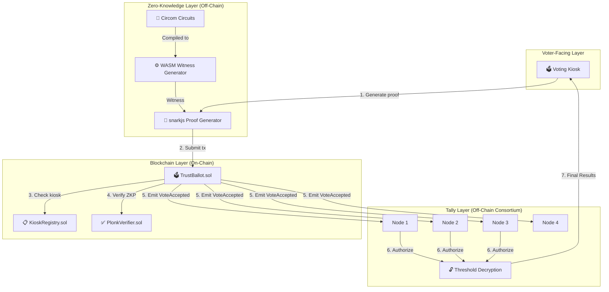
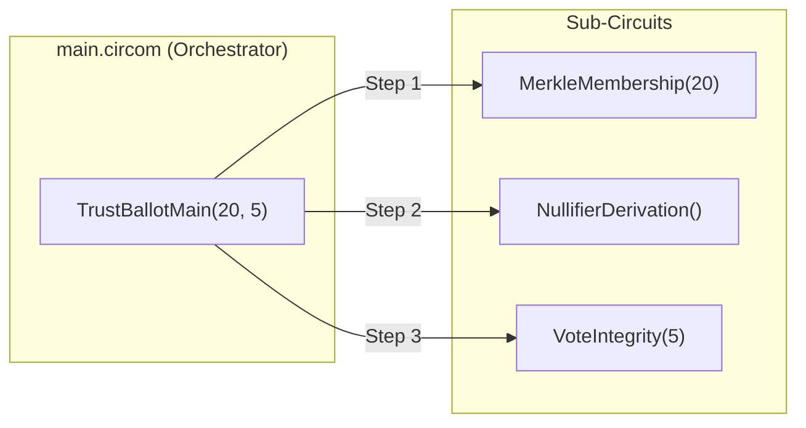
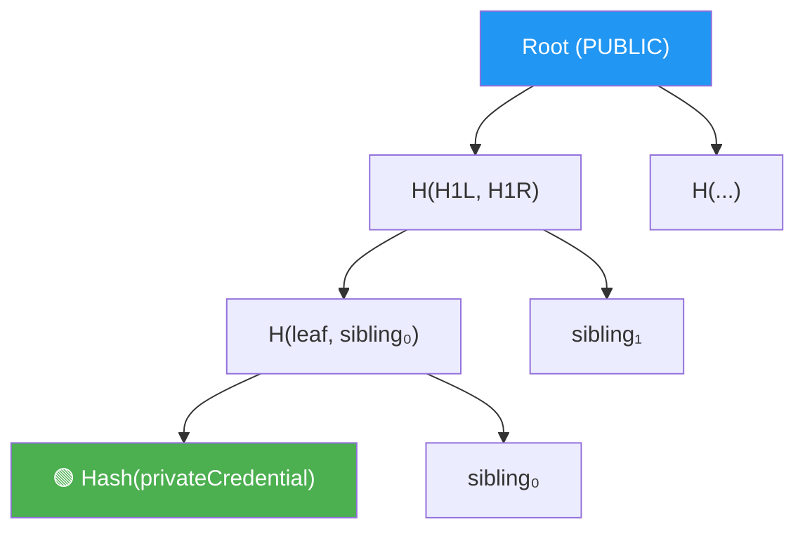
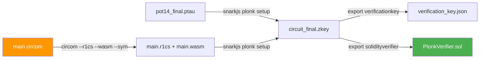
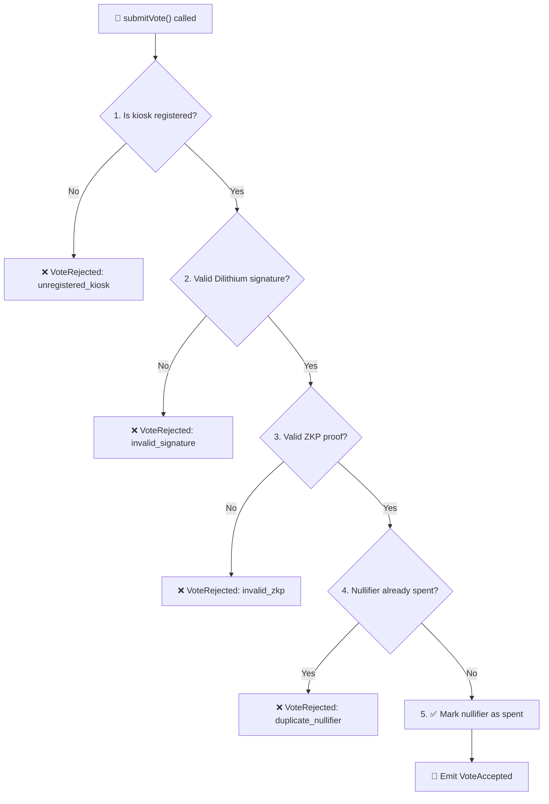
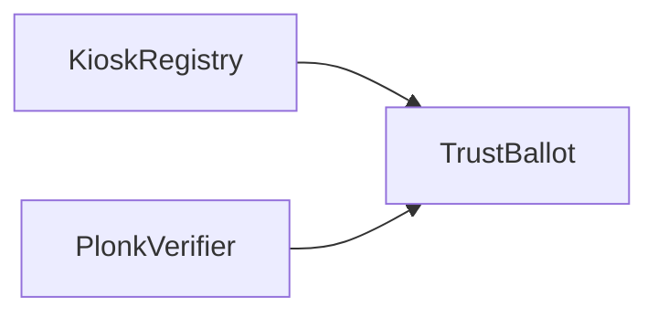
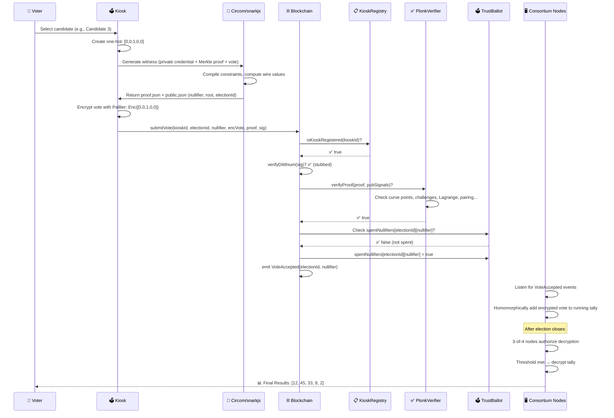
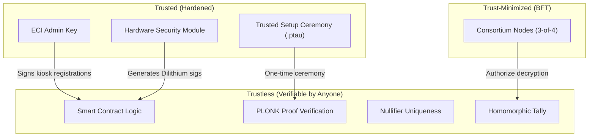

# TrustBallot — Blockchain Layer: A Complete Deep Dive

> **From first principles to every line of code.**
> This document builds understanding layer by layer — starting from "what is a blockchain?" and ending at the exact Solidity assembly instructions in your PLONK verifier. Every file, every function, every design decision is covered.

---

## Table of Contents

1. [Foundational Concepts](#1-foundational-concepts)
2. [Architecture Overview](#2-architecture-overview)
3. [Technology Stack](#3-technology-stack)
4. [Layer 1 — Zero-Knowledge Circuits (Circom)](#4-layer-1--zero-knowledge-circuits-circom)
5. [Layer 2 — Trusted Setup & Proof Pipeline](#5-layer-2--trusted-setup--proof-pipeline)
6. [Layer 3 — Smart Contracts (Solidity)](#6-layer-3--smart-contracts-solidity)
7. [Layer 4 — Homomorphic Tally & BFT Consensus](#7-layer-4--homomorphic-tally--bft-consensus)
8. [Deployment & Testing](#8-deployment--testing)
9. [End-to-End Vote Flow](#9-end-to-end-vote-flow)
10. [File-by-File Reference](#10-file-by-file-reference)
11. [Security Model & Trust Boundaries](#11-security-model--trust-boundaries)
12. [Current Limitations & MVP Stubs](#12-current-limitations--mvp-stubs)

---

## 1. Foundational Concepts

### 1.1 What is a Blockchain?

A blockchain is an **append-only, distributed ledger** where each "block" contains a batch of transactions cryptographically linked to the previous block. Key properties:

| Property | How TrustBallot Uses It |
|---|---|
| **Immutability** | Once a vote is recorded on-chain, it cannot be altered or deleted |
| **Transparency** | Anyone can audit the chain and verify votes were counted correctly |
| **Decentralization** | No single party (not even the Election Commission) can tamper with results unilaterally |
| **Consensus** | Multiple nodes must agree before a block is finalized |

### 1.2 What are Smart Contracts?

Smart contracts are **self-executing programs deployed on the blockchain**. They encode rules (e.g., "reject duplicate votes") that execute automatically when invoked. TrustBallot uses three smart contracts:

1. **KioskRegistry** — Whitelists authorized voting kiosks
2. **PlonkVerifier** — Mathematically verifies zero-knowledge proofs on-chain
3. **TrustBallot** — The main contract that orchestrates the vote pipeline

### 1.3 What is a Zero-Knowledge Proof (ZKP)?

A ZKP allows a **prover** (the voting kiosk) to convince a **verifier** (the smart contract) that a statement is true *without revealing any private information*. In TrustBallot:

- **Statement**: *"I am a registered voter, I haven't voted yet, and my vote is valid"*
- **What is NOT revealed**: The voter's identity, their private credential, or which candidate they chose

### 1.4 What is PLONK?

PLONK (Permutations over Lagrange-bases for Oecumenical Noninteractive arguments of Knowledge) is a **universal zk-SNARK proof system**. Key advantages:

- **Universal trusted setup** — One ceremony works for all circuits (the `.ptau` files)
- **Succinct proofs** — Proof size is constant (~1 KB) regardless of circuit complexity
- **On-chain verification** — A Solidity verifier can check proofs in ~300K gas

### 1.5 What is Homomorphic Encryption?

Homomorphic encryption allows **computations on encrypted data**. TrustBallot uses **Paillier encryption** where:

```
Encrypt(A) + Encrypt(B) = Encrypt(A + B)
```

This means votes can be **tallied while still encrypted** — no one sees individual votes.

### 1.6 What is BFT Consensus?

Byzantine Fault Tolerance (BFT) ensures the system works correctly even if some nodes are **malicious or offline**. TrustBallot uses a **t-of-n threshold** model:

- **n = 4** nodes in the consortium
- **t = 3** nodes must authorize decryption
- System tolerates **1 Byzantine failure** (one compromised or crashed node)

---

## 2. Architecture Overview



**The full pipeline has 7 stages:**

| Stage | Location | What Happens |
|-------|----------|-------------|
| 1 | Kiosk (off-chain) | Voter selects candidate → Circom circuit computes witness → snarkjs generates PLONK proof |
| 2 | Kiosk → Blockchain | Kiosk submits transaction with: kioskId, electionId, nullifier, encrypted vote, ZKP proof, Dilithium signature |
| 3 | KioskRegistry (on-chain) | Contract checks the kiosk is ECI-authorized |
| 4 | PlonkVerifier (on-chain) | Contract mathematically verifies the ZKP in ~300K gas |
| 5 | TrustBallot (on-chain) | Contract checks nullifier uniqueness, emits `VoteAccepted` event, records encrypted vote |
| 6 | Consortium Nodes (off-chain) | 3-of-4 nodes authorize the decryption |
| 7 | Threshold Decryption | Combined key shares decrypt the homomorphic tally → final results |

---

## 3. Technology Stack

### 3.1 Dependencies

From [package.json](file:///d:/Dev/trustballot/package.json):

| Package | Version | Purpose |
|---------|---------|---------|
| `hardhat` | ^3.17.0 | Ethereum development framework — compilation, testing, local blockchain |
| `ethers` | ^6.17.0 | JavaScript Ethereum library for contract interaction |
| `snarkjs` | ^0.7.6 | zk-SNARK proof system (PLONK setup, proof generation, verification) |
| `circomlib` | ^2.0.5 | Standard library of Circom circuit templates (Poseidon hash, MUX, etc.) |
| `circomlibjs` | ^0.1.7 | JavaScript bindings for Circom library functions |
| `chai` | ^6.2.2 | Test assertion library |
| `phe` (Python) | 1.5.0 | Paillier Homomorphic Encryption library |

### 3.2 Hardhat Configuration

From [hardhat.config.js](file:///d:/Dev/trustballot/hardhat.config.js):

```javascript
export default {
  solidity: "0.8.24",       // Solidity compiler version
  paths: {
    sources: "./contracts",  // Smart contract source files
    tests: "./test",         // Test files
    cache: "./cache",        // Compilation cache
    artifacts: "./artifacts" // Compiled contract ABIs and bytecode
  }
};
```

> [!NOTE]
> The project uses **ES Modules** (`"type": "module"` in package.json), so all imports use `import` syntax rather than `require()`.

### 3.3 Trusted Setup Files (Powers of Tau)

The root directory contains `.ptau` files used in the PLONK trusted setup ceremony:

| File | Size | Purpose |
|------|------|---------|
| `pot12_0000.ptau` | 1.5 MB | Initial Powers of Tau (2^12 = 4,096 constraints) |
| `pot12_0001.ptau` | 1.5 MB | After first contribution |
| `pot14_0000.ptau` | 6.3 MB | Initial Powers of Tau (2^14 = 16,384 constraints) |
| `pot14_0001.ptau` | 6.3 MB | After first contribution |
| `pot14_final.ptau` | 18.9 MB | **Finalized** — used for PLONK setup |

> [!IMPORTANT]
> The `pot14_final.ptau` supports circuits with up to **16,384 constraints**. The TrustBallot circuit uses `n = 16384` constraints (see PlonkVerifier line 42), which exactly matches this limit. A larger circuit would require `pot15` or higher.

---

## 4. Layer 1 — Zero-Knowledge Circuits (Circom)

The ZK circuits live in [`circuits/`](file:///d:/Dev/trustballot/circuits) and define the **mathematical rules** that a voter must prove without revealing private data.

### 4.1 Circuit Architecture



**Parameters:**
- `levels = 20` → Merkle tree with **2^20 = 1,048,576** possible registered voters
- `numCandidates = 5` → Election supports **5 candidates**

### 4.2 Main Circuit — [main.circom](file:///d:/Dev/trustballot/circuits/main.circom)

```circom
pragma circom 2.0.0;

include "merkle_membership.circom";
include "nullifier.circom";
include "vote_integrity.circom";
include "../node_modules/circomlib/circuits/poseidon.circom";

template TrustBallotMain(levels, numCandidates) {
    // Public Inputs (visible to verifier/smart contract)
    signal input root;          // Merkle root of all registered voters
    signal input electionId;    // Unique election identifier

    // Private Inputs (known only to the voter)
    signal input privateCredential;              // Voter's secret key
    signal input pathElements[levels];           // Merkle proof siblings (20 hashes)
    signal input pathIndices[levels];            // Left/right path directions (20 bits)
    signal input candidateSelection[numCandidates]; // One-hot vote [0,1,0,0,0]

    // Output
    signal output nullifier;   // Deterministic, anonymous anti-double-vote token

    // --- Step 1: Verify Merkle Membership ---
    component credHasher = Poseidon(1);
    credHasher.inputs[0] <== privateCredential;
    // credHasher.out = Hash(privateCredential) = the voter's "leaf" in the Merkle tree

    component merkle = MerkleMembership(levels);
    merkle.leaf <== credHasher.out;
    merkle.root <== root;
    for (var i = 0; i < levels; i++) {
        merkle.pathElements[i] <== pathElements[i];
        merkle.pathIndices[i] <== pathIndices[i];
    }
    // Constraint: Hash chain from leaf → root MUST match the public root

    // --- Step 2: Nullifier Derivation ---
    component nullifierGen = NullifierDerivation();
    nullifierGen.privateCredential <== privateCredential;
    nullifierGen.electionId <== electionId;
    nullifier <== nullifierGen.nullifier;
    // Output: nullifier = Poseidon(privateCredential, electionId)
    // Same voter + same election → ALWAYS produces the same nullifier
    // But the nullifier reveals NOTHING about privateCredential

    // --- Step 3: Vote Integrity ---
    component integrity = VoteIntegrity(numCandidates);
    for (var i = 0; i < numCandidates; i++) {
        integrity.candidateSelection[i] <== candidateSelection[i];
    }
    // Constraint: Exactly ONE candidate must be selected
}

// Instantiation: 20-level tree, 5 candidates
// Public signals: root, electionId
component main {public [root, electionId]} = TrustBallotMain(20, 5);
```

**What the circuit proves in one proof:**

| Claim | How |
|-------|-----|
| "I am a registered voter" | Merkle membership proof (leaf exists in tree with public root) |
| "I haven't voted before" | Deterministic nullifier derivation (same credential → same nullifier) |
| "My vote is valid" | One-hot constraint (exactly one `1`, rest are `0`s) |

### 4.3 Merkle Membership — [merkle_membership.circom](file:///d:/Dev/trustballot/circuits/merkle_membership.circom)

This circuit verifies that a voter's credential exists in the Merkle tree of registered voters.

```circom
pragma circom 2.0.0;

include "../node_modules/circomlib/circuits/poseidon.circom";
include "../node_modules/circomlib/circuits/mux1.circom";

template MerkleMembership(levels) {
    signal input leaf;                    // Hash(privateCredential)
    signal input root;                    // Public Merkle root
    signal input pathElements[levels];    // Sibling hashes along the path
    signal input pathIndices[levels];     // 0 = leaf is left child, 1 = right child

    component hashers[levels];    // One Poseidon hasher per level
    component mux[levels];        // One multiplexer per level

    signal currentHash[levels + 1];
    currentHash[0] <== leaf;      // Start from the leaf

    for (var i = 0; i < levels; i++) {
        hashers[i] = Poseidon(2);       // Hash two children to get parent
        mux[i] = MultiMux1(2);          // Select left/right ordering

        // If pathIndices[i] == 0: currentHash is LEFT, sibling is RIGHT
        // If pathIndices[i] == 1: currentHash is RIGHT, sibling is LEFT
        mux[i].c[0][0] <== currentHash[i];
        mux[i].c[0][1] <== pathElements[i];
        mux[i].c[1][0] <== pathElements[i];
        mux[i].c[1][1] <== currentHash[i];
        mux[i].s <== pathIndices[i];

        hashers[i].inputs[0] <== mux[i].out[0];  // Left child
        hashers[i].inputs[1] <== mux[i].out[1];  // Right child

        currentHash[i + 1] <== hashers[i].out;   // Parent hash
    }

    // Final constraint: computed root MUST equal the public root
    root === currentHash[levels];
}
```

**Visual walkthrough (simplified 3-level tree):**



The circuit walks from `leaf` up to `root` by hashing pairs at each level. If the computed root ≠ the public root, the proof is **invalid**.

### 4.4 Nullifier Derivation — [nullifier.circom](file:///d:/Dev/trustballot/circuits/nullifier.circom)

```circom
pragma circom 2.0.0;

include "../node_modules/circomlib/circuits/poseidon.circom";

// nullifier = Poseidon(privateCredential, electionId)
template NullifierDerivation() {
    signal input privateCredential;
    signal input electionId;
    signal output nullifier;

    component hasher = Poseidon(2);
    hasher.inputs[0] <== privateCredential;
    hasher.inputs[1] <== electionId;

    nullifier <== hasher.out;
}
```

**Why this works for anti-double-voting:**

| Property | Explanation |
|----------|-------------|
| **Deterministic** | Same `privateCredential` + same `electionId` → same `nullifier` every time |
| **One-way** | Given the `nullifier`, you cannot reverse-engineer `privateCredential` (Poseidon is a one-way hash) |
| **Election-scoped** | Different `electionId` → different `nullifier`, so credentials can be reused across elections |

The smart contract stores all spent nullifiers. If a nullifier is already recorded → vote rejected as duplicate.

### 4.5 Vote Integrity — [vote_integrity.circom](file:///d:/Dev/trustballot/circuits/vote_integrity.circom)

```circom
pragma circom 2.0.0;

template VoteIntegrity(numCandidates) {
    signal input candidateSelection[numCandidates];

    signal sum[numCandidates + 1];
    sum[0] <== 0;

    for (var i = 0; i < numCandidates; i++) {
        // Constraint 1: Each value MUST be 0 or 1
        // x * (x - 1) === 0  ↔  x ∈ {0, 1}
        candidateSelection[i] * (candidateSelection[i] - 1) === 0;

        // Running sum
        sum[i + 1] <== sum[i] + candidateSelection[i];
    }

    // Constraint 2: Exactly ONE candidate selected
    sum[numCandidates] === 1;
}
```

**Mathematical proof that this works:**

1. `x * (x - 1) === 0` has exactly two solutions: `x = 0` or `x = 1` (binary constraint)
2. The sum of all binary values must equal exactly `1` (one-hot constraint)
3. Together: the array must be something like `[0, 0, 1, 0, 0]` — exactly one `1`

### 4.6 Circuit Test Input — [input.json](file:///d:/Dev/trustballot/circuits/input.json)

```json
{
  "root": "5719944538356554403817391916218209963465482684641156206505489751898082045988",
  "electionId": "1",
  "privateCredential": "12345",
  "pathElements": [0,0,0,0,0,0,0,0,0,0,0,0,0,0,0,0,0,0,0,0],
  "pathIndices": [0,0,0,0,0,0,0,0,0,0,0,0,0,0,0,0,0,0,0,0],
  "candidateSelection": [1,0,0,0,0]
}
```

This is a **development test vector**:
- `privateCredential = 12345` → the voter's secret
- `pathElements` all zeros → represents a degenerate Merkle tree (leftmost leaf, all siblings are zero)
- `pathIndices` all zeros → leaf is always the left child
- `candidateSelection = [1,0,0,0,0]` → voter selected Candidate #1
- `root` → the precomputed root for this specific test configuration

### 4.7 Generated Artifacts

After circuit compilation and proof generation, these artifacts are produced:

| File | Size | Purpose |
|------|------|---------|
| [`main.r1cs`](file:///d:/Dev/trustballot/circuits/main.r1cs) | 1.5 MB | Rank-1 Constraint System — the compiled circuit as a set of mathematical constraints |
| [`main.sym`](file:///d:/Dev/trustballot/circuits/main.sym) | 926 KB | Symbol file mapping wire names to constraint indices (for debugging) |
| [`main_js/main.wasm`](file:///d:/Dev/trustballot/circuits/main_js/main.wasm) | 2.0 MB | WebAssembly witness generator — computes all intermediate wire values |
| [`main_js/generate_witness.js`](file:///d:/Dev/trustballot/circuits/main_js/generate_witness.js) | 697 B | Node.js wrapper that loads the WASM and runs witness generation |
| [`main_js/witness_calculator.js`](file:///d:/Dev/trustballot/circuits/main_js/witness_calculator.js) | 10 KB | JavaScript witness calculator engine |
| [`circuit_final.zkey`](file:///d:/Dev/trustballot/circuits/circuit_final.zkey) | 30 MB | PLONK proving key — contains the circuit-specific setup parameters |
| [`verification_key.json`](file:///d:/Dev/trustballot/circuits/verification_key.json) | 2 KB | PLONK verification key — embedded into the Solidity verifier |
| [`proof.json`](file:///d:/Dev/trustballot/circuits/proof.json) | 2.3 KB | A generated PLONK proof for the test input |
| [`public.json`](file:///d:/Dev/trustballot/circuits/public.json) | 170 B | Public signals: `[nullifier, root, electionId]` |

---

## 5. Layer 2 — Trusted Setup & Proof Pipeline

### 5.1 The Setup Script — [setup_plonk.sh](file:///d:/Dev/trustballot/scripts/setup_plonk.sh)

This shell script runs the entire PLONK setup pipeline:

```bash
#!/bin/bash
set -e

cd d:/Dev/trustballot

# Step 1: Compile the Circom circuit
cd circuits
circom main.circom --r1cs --wasm --sym
# Outputs: main.r1cs, main.sym, main_js/ (WASM + JS)

# Step 2: PLONK trusted setup
# Takes the universal .ptau and creates a circuit-specific .zkey
npx snarkjs plonk setup main.r1cs ../pot14_final.ptau circuit_final.zkey
# Output: circuit_final.zkey (30 MB proving key)

# Step 3: Export the verification key
npx snarkjs zkey export verificationkey circuit_final.zkey verification_key.json
# Output: verification_key.json (used for off-chain verification)

# Step 4: Generate the Solidity verifier contract
npx snarkjs zkey export solidityverifier circuit_final.zkey ../contracts/PlonkVerifier.sol
# Output: PlonkVerifier.sol (auto-generated, 881 lines of Solidity assembly)
```

### 5.2 Pipeline Diagram



### 5.3 What Happens During Proof Generation (Runtime)

When a voter casts a vote, the kiosk runs:

```bash
# 1. Generate witness (compute all intermediate wire values)
node circuits/main_js/generate_witness.js \
     circuits/main_js/main.wasm \
     circuits/input.json \
     witness.wtns

# 2. Generate PLONK proof
npx snarkjs plonk prove \
     circuits/circuit_final.zkey \
     witness.wtns \
     proof.json \
     public.json
```

### 5.4 The Proof Structure — [proof.json](file:///d:/Dev/trustballot/circuits/proof.json)

A PLONK proof consists of **9 elliptic curve points** and **6 field element evaluations**:

```json
{
  "A":  [x, y, 1],   // Polynomial commitment A (wire a)
  "B":  [x, y, 1],   // Polynomial commitment B (wire b)
  "C":  [x, y, 1],   // Polynomial commitment C (wire c)
  "Z":  [x, y, 1],   // Permutation polynomial commitment
  "T1": [x, y, 1],   // Quotient polynomial part 1
  "T2": [x, y, 1],   // Quotient polynomial part 2
  "T3": [x, y, 1],   // Quotient polynomial part 3
  "Wxi":  [x, y, 1], // Opening proof at ξ
  "Wxiw": [x, y, 1], // Opening proof at ξ·ω

  "eval_a":  "...",   // Evaluation of wire a polynomial at ξ
  "eval_b":  "...",   // Evaluation of wire b polynomial at ξ
  "eval_c":  "...",   // Evaluation of wire c polynomial at ξ
  "eval_s1": "...",   // Evaluation of permutation polynomial σ₁ at ξ
  "eval_s2": "...",   // Evaluation of permutation polynomial σ₂ at ξ
  "eval_zw": "...",   // Evaluation of Z polynomial at ξ·ω

  "protocol": "plonk",
  "curve": "bn128"
}
```

This is **24 uint256 values** when flattened — which maps exactly to the `uint256[24] calldata zkpProof` parameter in the smart contract.

### 5.5 The Public Signals — [public.json](file:///d:/Dev/trustballot/circuits/public.json)

```json
[
  "4213355460611018654523924795294902999663126022355729006200928612083214729114",
  "5719944538356554403817391916218209963465482684641156206505489751898082045988",
  "1"
]
```

These are the **3 public signals** (`nPublic = 3` in the verifier):

| Index | Signal | Value |
|-------|--------|-------|
| 0 | `nullifier` | `4213355...` (output of `Poseidon(12345, 1)`) |
| 1 | `root` | `5719944...` (Merkle tree root) |
| 2 | `electionId` | `1` |

---

## 6. Layer 3 — Smart Contracts (Solidity)

### 6.1 KioskRegistry — [KioskRegistry.sol](file:///d:/Dev/trustballot/contracts/KioskRegistry.sol)

**Purpose:** Before any election, the Election Commission of India (ECI) must **whitelist** each voting kiosk. Only registered kiosks can submit votes.

#### Contract State

```solidity
contract KioskRegistry {
    address public eciAdmin;                          // ECI admin's Ethereum address
    mapping(string => string) public kioskPubKeys;    // kioskId → public key
    mapping(string => bool) public isKioskRegistered; // kioskId → registered?
}
```

#### Constructor

```solidity
constructor() {
    eciAdmin = msg.sender;  // Deployer becomes ECI admin
}
```

#### Access Control

```solidity
modifier onlyAdmin() {
    require(msg.sender == eciAdmin, "Only ECI Admin can perform this action");
    _;
}
```

#### Kiosk Registration (with ECDSA signature verification)

```solidity
function registerKiosk(
    string memory kioskId,
    string memory pubKey,
    bytes memory eciSignature
) external onlyAdmin {
    // Step 1: Create the message hash
    bytes32 messageHash = keccak256(abi.encodePacked(kioskId, pubKey));

    // Step 2: Prefix with Ethereum's personal_sign format
    bytes32 ethSignedMessageHash = keccak256(
        abi.encodePacked("\x19Ethereum Signed Message:\n32", messageHash)
    );

    // Step 3: Recover signer from signature and verify it's the admin
    require(
        recoverSigner(ethSignedMessageHash, eciSignature) == eciAdmin,
        "Invalid ECI signature"
    );

    // Step 4: Register the kiosk
    kioskPubKeys[kioskId] = pubKey;
    isKioskRegistered[kioskId] = true;

    emit KioskRegistered(kioskId, pubKey);
}
```

#### Signature Recovery (ECDSA)

```solidity
function splitSignature(bytes memory sig)
    internal pure returns (uint8 v, bytes32 r, bytes32 s)
{
    require(sig.length == 65, "invalid signature length");
    assembly {
        r := mload(add(sig, 32))  // First 32 bytes
        s := mload(add(sig, 64))  // Next 32 bytes
        v := byte(0, mload(add(sig, 96)))  // Last byte (recovery id)
    }
}

function recoverSigner(bytes32 message, bytes memory sig)
    internal pure returns (address)
{
    (uint8 v, bytes32 r, bytes32 s) = splitSignature(sig);
    return ecrecover(message, v, r, s);  // EVM precompile at address 0x01
}
```

> [!NOTE]
> `ecrecover` is an **EVM precompile** (built into the virtual machine) that recovers the Ethereum address that signed a message. It costs only 3,000 gas.

### 6.2 PlonkVerifier — [PlonkVerifier.sol](file:///d:/Dev/trustballot/contracts/PlonkVerifier.sol)

**Purpose:** This is an **auto-generated** 881-line Solidity contract that verifies PLONK proofs entirely on-chain using inline assembly for gas efficiency.

> [!IMPORTANT]
> This contract was NOT hand-written. It was generated by `snarkjs zkey export solidityverifier` from the circuit's proving key. The verification key constants are **baked into the contract** at generation time.

#### Key Constants

```solidity
// Elliptic Curve Parameters (BN128)
uint256 constant q  = 21888242871839275222246405745257275088548364400416034343698204186575808495617;  // Scalar field size
uint256 constant qf = 21888242871839275222246405745257275088696311157297823662689037894645226208583;  // Base field size

// Circuit Size
uint32 constant n         = 16384;  // Number of constraints (2^14)
uint16 constant nPublic   = 3;      // Number of public signals [nullifier, root, electionId]
uint16 constant nLagrange = 3;      // Number of Lagrange polynomials needed

// Verification Key Points (from verification_key.json, embedded as constants)
uint256 constant Qmx = ...; uint256 constant Qmy = ...;  // Multiplication gate selector
uint256 constant Qlx = ...; uint256 constant Qly = ...;  // Left wire selector
uint256 constant Qrx = ...; uint256 constant Qry = ...;  // Right wire selector
uint256 constant Qox = ...; uint256 constant Qoy = ...;  // Output wire selector
uint256 constant Qcx = ...; uint256 constant Qcy = ...;  // Constant selector
uint256 constant S1x = ...; uint256 constant S1y = ...;  // Permutation polynomial σ₁
uint256 constant S2x = ...; uint256 constant S2y = ...;  // Permutation polynomial σ₂
uint256 constant S3x = ...; uint256 constant S3y = ...;  // Permutation polynomial σ₃
```

#### The Verification Function

```solidity
function verifyProof(
    uint256[24] calldata _proof,      // 9 EC points (2 coords each) + 6 evaluations
    uint256[3]  calldata _pubSignals  // [nullifier, root, electionId]
) public view returns (bool)
```

**The verification proceeds in 8 stages, all in pure assembly:**

| Stage | Function | What it does |
|-------|----------|-------------|
| 1 | `checkProofData()` | Validates all 9 EC points lie on the BN128 curve (`y² = x³ + 3`) and all field elements are < q |
| 2 | `calculateChallenges()` | Derives Fiat-Shamir challenges (α, β, γ, ξ, v, u) by hashing proof components |
| 3 | `calculateLagrange()` | Computes Lagrange polynomial evaluations L₁(ξ), L₂(ξ), L₃(ξ) |
| 4 | `calculatePI()` | Computes the public input polynomial PI(ξ) |
| 5 | `calculateR0()` | Computes the linearization constant r₀ |
| 6 | `calculateD()` | Computes the linearization commitment D |
| 7 | `calculateF()` and `calculateE()` | Computes the batched opening commitments F and E |
| 8 | `checkPairing()` | Performs the final **elliptic curve pairing check** using EVM precompile at address 0x08 |

#### EVM Precompiles Used

The verifier makes heavy use of three EVM precompiles for BN128 curve operations:

| Address | Precompile | Gas Cost | Used For |
|---------|-----------|----------|----------|
| `0x06` | `ecAdd` | 150 gas | Elliptic curve point addition |
| `0x07` | `ecMul` | 6,000 gas | Elliptic curve scalar multiplication |
| `0x08` | `ecPairing` | 45,000 + 34,000/pair | Bilinear pairing check (the final verification step) |

#### The Pairing Check (The Heart of Verification)

The final step [`checkPairing()`](file:///d:/Dev/trustballot/contracts/PlonkVerifier.sol#L817-L859) performs:

```
e(A₁, [X]₂) · e(B₁, [1]₂) == 1
```

Where `e` is the bilinear pairing on BN128. This is mathematically equivalent to checking that all the polynomial commitments are consistent — i.e., the prover actually knows a valid witness.

### 6.3 TrustBallot — [TrustBallot.sol](file:///d:/Dev/trustballot/contracts/TrustBallot.sol)

**Purpose:** The main orchestrator contract that ties everything together.

#### Contract State

```solidity
contract TrustBallot {
    KioskRegistry public kioskRegistry;     // Reference to kiosk whitelist
    PlonkVerifier public plonkVerifier;     // Reference to ZKP verifier

    // Double-vote prevention: electionId → nullifier → spent?
    mapping(uint256 => mapping(uint256 => bool)) public spentNullifiers;

    event VoteAccepted(uint256 indexed electionId, uint256 nullifier);
    event VoteRejected(uint256 indexed electionId, string reason);
}
```

#### Constructor (Dependency Injection)

```solidity
constructor(address _kioskRegistryAddress, address _plonkVerifierAddress) {
    kioskRegistry = KioskRegistry(_kioskRegistryAddress);
    plonkVerifier = PlonkVerifier(_plonkVerifierAddress);
}
```

#### The Vote Submission Pipeline

```solidity
function submitVote(
    string memory kioskId,            // Which kiosk is submitting
    uint256 electionId,               // Which election
    uint256 nullifier,                // ZKP-derived nullifier
    bytes memory ciphertextVote,      // Homomorphically encrypted vote
    uint256[24] calldata zkpProof,    // PLONK proof (24 uint256s)
    bytes memory dilithiumSignature   // Post-quantum signature (stubbed)
) external {
```

**The 5-step validation pipeline:**



**Step-by-step code walkthrough:**

```solidity
// Step 1: Kiosk Authorization
if (!kioskRegistry.isKioskRegistered(kioskId)) {
    emit VoteRejected(electionId, "unregistered_kiosk");
    return;
}

// Step 2: Post-Quantum Signature (STUBBED for MVP)
if (!verifyDilithium(dilithiumSignature, kioskId)) {
    emit VoteRejected(electionId, "invalid_signature");
    return;
}

// Step 3: ZKP Verification
uint256[3] memory pubSignals;
pubSignals[0] = nullifier;     // The nullifier must match what the circuit computed
pubSignals[1] = 0;             // Merkle root (TODO: retrieve from on-chain state)
pubSignals[2] = electionId;    // Election ID must match

if (!plonkVerifier.verifyProof(zkpProof, pubSignals)) {
    emit VoteRejected(electionId, "invalid_zkp");
    return;
}

// Step 4: Double-Vote Prevention
if (spentNullifiers[electionId][nullifier]) {
    emit VoteRejected(electionId, "duplicate_nullifier");
    return;
}

// Step 5: Record Vote
spentNullifiers[electionId][nullifier] = true;
emit VoteAccepted(electionId, nullifier);
```

#### Dilithium Signature Stub

```solidity
// Post-quantum signature verification — always returns true in MVP
function verifyDilithium(
    bytes memory /* signature */,
    string memory /* kioskId */
) internal pure returns (bool) {
    return true;
}
```

> [!WARNING]
> The Dilithium signature verification is **completely stubbed** (`return true`). In production, this would integrate with a custom EVM precompile or an oracle to verify CRYSTALS-Dilithium post-quantum signatures from each kiosk's hardware security module.

---

## 7. Layer 4 — Homomorphic Tally & BFT Consensus

### 7.1 Paillier Homomorphic Encryption — [tally.py](file:///d:/Dev/trustballot/tally/tally.py)

#### Key Generation

```python
from phe import paillier

def generate_keys():
    """Generates a Paillier keypair for the election."""
    public_key, private_key = paillier.generate_paillier_keypair()
    return public_key, private_key
```

Paillier keys are generated once per election. The **public key** is distributed to all kiosks. The **private key** is split (conceptually) across the consortium nodes.

#### Vote Encryption (One-Hot Encoding)

```python
def encrypt_vote(public_key, candidate_selection):
    """
    Encrypts a one-hot candidate selection array.
    Example: [0, 1, 0, 0] → [Enc(0), Enc(1), Enc(0), Enc(0)]
    """
    return [public_key.encrypt(val) for val in candidate_selection]
```

Each candidate position is encrypted **independently**, producing an array of ciphertexts.

#### Homomorphic Addition (The Magic)

```python
def add_votes(encrypted_vote1, encrypted_vote2):
    """
    Homomorphically adds two encrypted votes without decrypting them.
    Enc(A) + Enc(B) = Enc(A+B)
    """
    return [v1 + v2 for v1, v2 in zip(encrypted_vote1, encrypted_vote2)]
```

**Example:**

```
Voter 1 selects Candidate B: Enc([0, 1, 0])
Voter 2 selects Candidate A: Enc([1, 0, 0])
Voter 3 selects Candidate B: Enc([0, 1, 0])

Running tally (encrypted):    Enc([1, 2, 0])
After decryption:             [1, 2, 0]
→ Candidate A: 1 vote, Candidate B: 2 votes
```

> [!TIP]
> The `+` operator on `phe.EncryptedNumber` objects performs **homomorphic addition** — it operates on the ciphertext using modular arithmetic without ever seeing the plaintext.

#### Threshold Decryption — [ThresholdTally class](file:///d:/Dev/trustballot/tally/tally.py#L4-L27)

```python
class ThresholdTally:
    """
    Simulates a threshold decryption mechanism for a BFT consortium.
    In production: Shamir's Secret Sharing splits the private key across N nodes.
    Here: threshold check + master key decryption (prototype simulation).
    """
    def __init__(self, public_key, private_key, num_nodes=4, threshold=3):
        self.public_key = public_key
        self._private_key = private_key
        self.num_nodes = num_nodes     # 4 nodes total
        self.threshold = threshold     # 3 must authorize

    def decrypt_tally(self, encrypted_tally, auth_shares):
        """
        Decrypts ONLY if t-of-n authorized shares are provided.
        """
        if len(set(auth_shares)) < self.threshold:
            raise ValueError(
                f"Decryption failed: {len(auth_shares)} shares provided, "
                f"{self.threshold} required."
            )
        # Prototype: uses master key directly
        return [self._private_key.decrypt(val) for val in encrypted_tally]
```

### 7.2 Tally HTTP Server — [server.py](file:///d:/Dev/trustballot/tally/server.py)

Each consortium node runs this HTTP server:

| Endpoint | Method | Purpose |
|----------|--------|---------|
| `GET /status` | GET | Health check (`{"status": "running"}`) |
| `GET /transactions` | GET | List recent vote transaction hashes |
| `POST /add_vote` | POST | Submit an encrypted vote to the tally |
| `POST /authorize` | POST | Add a node's decryption authorization |
| `POST /decrypt` | POST | Attempt threshold decryption |

#### Vote Submission Endpoint

```python
if self.path == '/add_vote':
    vote_index = req.get("vote", 0)

    # Convert candidate index to one-hot array (12 candidates)
    num_candidates = 12
    vote_array = [0] * num_candidates
    if isinstance(vote_index, int) and 1 <= vote_index <= num_candidates:
        vote_array[vote_index - 1] = 1

    encrypted_vote = encrypt_vote(pub_key, vote_array)
    if running_tally is None:
        running_tally = encrypted_vote
    else:
        running_tally = add_votes(running_tally, encrypted_vote)

    # Generate transaction hash for audit trail
    tx_data = f"{vote_index}-{time.time()}".encode('utf-8')
    tx_hash = '0x' + hashlib.sha256(tx_data).hexdigest()[:40]
```

### 7.3 Docker-Composed BFT Network — [docker-compose.yml](file:///d:/Dev/trustballot/docker-compose.yml)

```yaml
services:
  node1:
    build: ./tally
    ports: ["8001:8000"]
    container_name: trustballot-node1
  node2:
    build: ./tally
    ports: ["8002:8000"]
    container_name: trustballot-node2
  node3:
    build: ./tally
    ports: ["8003:8000"]
    container_name: trustballot-node3
  node4:
    build: ./tally
    ports: ["8004:8000"]
    container_name: trustballot-node4
```

This creates **4 identical tally nodes** on ports 8001–8004, each running the same Python server. The [Dockerfile](file:///d:/Dev/trustballot/tally/Dockerfile) is minimal:

```dockerfile
FROM python:3.11-slim
WORKDIR /app
COPY requirements.txt requirements.txt
RUN pip install -r requirements.txt
COPY . .
EXPOSE 8000
CMD ["python", "server.py"]
```

### 7.4 BFT Failure Demo — [demo_bft.py](file:///d:/Dev/trustballot/demo_bft.py)

This script demonstrates the BFT resilience of the consortium:

```python
nodes = [
    "http://127.0.0.1:8001",
    "http://127.0.0.1:8002",
    "http://127.0.0.1:8003",
    "http://127.0.0.1:8004"
]

# Step 1: Submit votes
send_request(nodes[0], "/add_vote", {"vote": [1, 0, 0]})
send_request(nodes[0], "/add_vote", {"vote": [0, 1, 0]})

# Step 2: Authorize from 2 nodes (below threshold)
send_request(nodes[0], "/authorize", {"node_id": 1})
send_request(nodes[0], "/authorize", {"node_id": 2})

# Step 3: Try decryption → FAILS (2 < 3 threshold)
send_request(nodes[0], "/decrypt", {})

# Step 4: Authorize from 3rd node → meets threshold
send_request(nodes[0], "/authorize", {"node_id": 3})

# Step 5: Decrypt → SUCCESS
res = send_request(nodes[0], "/decrypt", {})
# Even with Node 4 offline, system works (3/4 threshold met)
```

---

## 8. Deployment & Testing

### 8.1 Deploy Script — [deploy.js](file:///d:/Dev/trustballot/scripts/deploy.js)

Deploys all three contracts in dependency order:

```javascript
async function main() {
  // 1. Deploy KioskRegistry (no dependencies)
  const KioskRegistry = await hre.ethers.getContractFactory("KioskRegistry");
  const kioskRegistry = await KioskRegistry.deploy();
  await kioskRegistry.waitForDeployment();

  // 2. Deploy PlonkVerifier (no dependencies)
  const PlonkVerifier = await hre.ethers.getContractFactory("PlonkVerifier");
  const plonkVerifier = await PlonkVerifier.deploy();
  await plonkVerifier.waitForDeployment();

  // 3. Deploy TrustBallot (depends on both)
  const TrustBallot = await hre.ethers.getContractFactory("TrustBallot");
  const trustBallot = await TrustBallot.deploy(
    kioskRegistryAddress,    // Injected dependency
    plonkVerifierAddress     // Injected dependency
  );
  await trustBallot.waitForDeployment();
}
```

**Deployment Order:**



`TrustBallot` takes the addresses of both other contracts as constructor arguments — this is the **dependency injection** pattern in Solidity.

### 8.2 Unit Tests — [TrustBallot.test.js](file:///d:/Dev/trustballot/test/TrustBallot.test.js)

```javascript
describe("TrustBallot End-to-End Integration", function () {
  // Setup: Deploy all 3 contracts
  before(async function () {
    [owner, eciAdmin, kioskNode] = await ethers.getSigners();
    // Deploy KioskRegistry, PlonkVerifier, TrustBallot...
  });

  describe("1. Kiosk Registration", function () {
    it("Should allow ECI admin to register a kiosk", async function () {
      const kioskId = "kiosk-001";
      const messageHash = ethers.id(kioskId);
      const signature = await eciAdmin.signMessage(ethers.getBytes(messageHash));
      await kioskRegistry.registerKiosk(kioskId, signature);
      expect(await kioskRegistry.isKioskRegistered(kioskId)).to.be.true;
    });
  });

  describe("2. Vote Submission and ZKP", function () {
    it("Should reject an invalid ZKP proof (mock proof)", async function () {
      const zkpProof = new Array(24).fill(0n); // Invalid: zero points
      // PlonkVerifier rejects because 0s aren't valid BN128 curve points
      // Transaction reverts due to assembly revert(0,0)
    });
  });
});
```

### 8.3 Integration Test — [integration_test.js](file:///d:/Dev/trustballot/scripts/integration_test.js)

This is a more comprehensive test that runs against a live Hardhat node:

```javascript
// Connect to local Hardhat node
const provider = new ethers.JsonRpcProvider("http://127.0.0.1:8545");

// Deploy all contracts, then:

// Test 1: Register a kiosk with proper ECDSA signature
const messageHash = ethers.solidityPackedKeccak256(
  ["string", "string"], [kioskId, pubKey]
);
const signature = await eciAdmin.signMessage(ethers.getBytes(messageHash));
await kioskRegistry.connect(eciAdmin).registerKiosk(kioskId, pubKey, signature);

// Test 2: Submit vote with invalid (zero) proof
const zkpProof = new Array(24).fill(0n);
const tx = await trustBallot.submitVote(
  kioskId, electionId, nullifier, ciphertextVote, zkpProof, dilithiumSig
);
// Expected: VoteRejected event with "invalid_zkp"
// PlonkVerifier correctly rejects the zero proof
```

---

## 9. End-to-End Vote Flow

Here is the **complete lifecycle of a single vote**, from voter intent to final tally:



---

## 10. File-by-File Reference

### Blockchain Core Files

| File | Lines | Purpose |
|------|-------|---------|
| [TrustBallot.sol](file:///d:/Dev/trustballot/contracts/TrustBallot.sol) | 85 | Main contract — vote pipeline orchestrator |
| [KioskRegistry.sol](file:///d:/Dev/trustballot/contracts/KioskRegistry.sol) | 58 | Kiosk whitelist with ECDSA signature verification |
| [PlonkVerifier.sol](file:///d:/Dev/trustballot/contracts/PlonkVerifier.sol) | 881 | Auto-generated PLONK proof verifier (BN128 assembly) |

### Zero-Knowledge Circuits

| File | Lines | Purpose |
|------|-------|---------|
| [main.circom](file:///d:/Dev/trustballot/circuits/main.circom) | 49 | Top-level circuit: Merkle + Nullifier + VoteIntegrity |
| [merkle_membership.circom](file:///d:/Dev/trustballot/circuits/merkle_membership.circom) | 40 | Prove voter is in the Merkle tree |
| [nullifier.circom](file:///d:/Dev/trustballot/circuits/nullifier.circom) | 18 | Derive deterministic anti-double-vote token |
| [vote_integrity.circom](file:///d:/Dev/trustballot/circuits/vote_integrity.circom) | 19 | Enforce one-hot candidate selection |
| [input.json](file:///d:/Dev/trustballot/circuits/input.json) | 9 | Test input vector |

### Generated Artifacts

| File | Purpose |
|------|---------|
| [circuit_final.zkey](file:///d:/Dev/trustballot/circuits/circuit_final.zkey) | PLONK proving key (30 MB) |
| [verification_key.json](file:///d:/Dev/trustballot/circuits/verification_key.json) | PLONK verification key |
| [proof.json](file:///d:/Dev/trustballot/circuits/proof.json) | Example PLONK proof |
| [public.json](file:///d:/Dev/trustballot/circuits/public.json) | Public signals: [nullifier, root, electionId] |
| [main.r1cs](file:///d:/Dev/trustballot/circuits/main.r1cs) | Compiled R1CS constraint system |
| [main.wasm](file:///d:/Dev/trustballot/circuits/main_js/main.wasm) | WASM witness generator |

### Tally & BFT

| File | Lines | Purpose |
|------|-------|---------|
| [tally.py](file:///d:/Dev/trustballot/tally/tally.py) | 80 | Paillier encryption + threshold decryption logic |
| [server.py](file:///d:/Dev/trustballot/tally/server.py) | 93 | HTTP API for each consortium node |
| [Dockerfile](file:///d:/Dev/trustballot/tally/Dockerfile) | 13 | Container definition for tally nodes |
| [docker-compose.yml](file:///d:/Dev/trustballot/docker-compose.yml) | 22 | 4-node BFT consortium orchestration |
| [demo_bft.py](file:///d:/Dev/trustballot/demo_bft.py) | 53 | BFT failure resilience demo |

### Scripts & Tests

| File | Lines | Purpose |
|------|-------|---------|
| [setup_plonk.sh](file:///d:/Dev/trustballot/scripts/setup_plonk.sh) | 26 | Circuit compilation + PLONK setup pipeline |
| [deploy.js](file:///d:/Dev/trustballot/scripts/deploy.js) | 32 | Hardhat deployment script for all 3 contracts |
| [integration_test.js](file:///d:/Dev/trustballot/scripts/integration_test.js) | 87 | E2E test against live Hardhat node |
| [TrustBallot.test.js](file:///d:/Dev/trustballot/test/TrustBallot.test.js) | 88 | Hardhat unit test suite |
| [hardhat.config.js](file:///d:/Dev/trustballot/hardhat.config.js) | 13 | Hardhat project configuration |

---

## 11. Security Model & Trust Boundaries



| Security Property | Mechanism | Status |
|-------------------|-----------|--------|
| **Voter anonymity** | ZKP (nullifier reveals nothing about identity) | ✅ Implemented |
| **Vote integrity** | One-hot constraint in Circom | ✅ Implemented |
| **Double-vote prevention** | Deterministic nullifier + on-chain mapping | ✅ Implemented |
| **Kiosk authorization** | ECDSA signature verification | ✅ Implemented |
| **Proof soundness** | PLONK verification on BN128 curve | ✅ Implemented |
| **Tally privacy** | Paillier homomorphic encryption | ✅ Implemented |
| **Fault tolerance** | 3-of-4 threshold decryption | ✅ Implemented |
| **Post-quantum security** | Dilithium signatures | ⚠️ Stubbed |
| **Merkle root management** | On-chain voter registry root | ⚠️ Hardcoded to 0 |

---

## 12. Current Limitations & MVP Stubs

> [!CAUTION]
> The following items are **stubbed or incomplete** in the current MVP and would need to be addressed before any real-world deployment.

| Component | Current State | Production Requirement |
|-----------|--------------|----------------------|
| **Dilithium Signature** | `return true` always | Integrate CRYSTALS-Dilithium via oracle or custom precompile |
| **Merkle Root** | Hardcoded to `0` in `submitVote()` | Maintain on-chain Merkle tree of registered voter credentials, update root dynamically |
| **Tally Sync** | Each Docker node runs independently | Implement gossip protocol or state sync between consortium nodes |
| **Shamir's Secret Sharing** | Threshold check only (master key used) | Actually split private key into shares using Shamir's scheme |
| **Gas Optimization** | Standard PLONK verifier | Consider recursive proofs or Groth16 for lower gas |
| **Event Storage** | `ciphertextVote` is not stored on-chain | Store in calldata (events) or use a separate data availability layer |
| **Access Control** | Single `eciAdmin` address | Multi-sig governance for admin operations |
| **Voter Registration** | Test input with known credential | Full registration flow with credential issuance |

---

> **Summary:** TrustBallot's blockchain layer is a 4-tier system:
> 1. **Circom circuits** define what the voter proves (membership + uniqueness + validity)
> 2. **snarkjs** compiles these into a PLONK proof system with on-chain verification
> 3. **Solidity contracts** orchestrate kiosk auth, ZKP verification, and nullifier tracking
> 4. **A Python-based BFT consortium** tallies encrypted votes and performs threshold decryption
>
> The system achieves **voter anonymity** (ZKP), **vote integrity** (one-hot constraints), **double-vote prevention** (nullifiers), and **fault tolerance** (3-of-4 BFT) — all while keeping individual votes **encrypted end-to-end** via Paillier homomorphic encryption.
